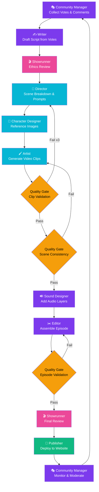

# Usage Guides — StorySmith AI / 剧匠AI

**Author: Chong Kiat Lim**

## Quick Start

### 1. Environment Setup

```bash
# Copy environment config
cp config/.env.example config/.env

# Edit config/.env and fill in your values
```

### 2. Install Dependencies & Run

```bash
cd site
npm install
npm run dev
```

The site will be available at `http://localhost:3000`.

### 3. Starting the Server

#### Development vs Production

| | Development (`npm run dev`) | Production (`npm run build && npm start`) |
|---|---|---|
| **Hot reload** | Yes — file changes reflect instantly | No — requires rebuild |
| **Performance** | Slower (pages compiled on-demand) | Fast (pre-built, optimized bundles) |
| **Error output** | Verbose stack traces in browser | Minimal user-friendly error pages |
| **Source maps** | Full (easy debugging) | Minimal |
| **Use when** | Building features, testing, debugging | Serving real users, deployment |

#### Development Mode

```bash
cd site
npm run dev
```

This starts Next.js in dev mode with hot-reload. Changes to source files are reflected immediately.

#### Windows (PowerShell) — If `npm` is not found

Node.js PATH may not be loaded in new terminals. The safe way to fix this **without losing your Python venv** is to append the Node.js path rather than replacing the entire PATH:

```powershell
# Safe: append Node.js to existing PATH (keeps venv intact)
$nodePath = (Get-Command node -ErrorAction SilentlyContinue).Source | Split-Path
if (-not $nodePath) {
    # Node not found at all — pull from registry
    $machinePath = [System.Environment]::GetEnvironmentVariable("Path", "Machine")
    $userPath = [System.Environment]::GetEnvironmentVariable("Path", "User")
    $env:Path = "$env:Path;$machinePath;$userPath"
}
cd site
npm run dev
```

Or simply use the provided startup script which handles this automatically:

```powershell
.\start-site.ps1
```

> **Warning**: Do NOT use `$env:Path = [Machine] + [User]` alone — this **replaces** your entire session PATH and removes active Python venvs.

#### Production Build

```bash
cd site
npm run build
npm start
```

#### Custom Port

```bash
npm run dev -- --port 3001
```

---

## Workflow

The episode generation pipeline follows this cycle:



---

## Configuration

All configuration lives in `config/.env`. The Next.js site reads this file automatically via `dotenv` in `next.config.js`.

| Variable | Description | Required |
|----------|-------------|----------|
| `HUGGINGFACE_API_TOKEN` | Your HuggingFace API token | Yes (for video generation) |
| `HUGGINGFACE_MODEL` | Model name (e.g. `hunyuanvideo`) | Yes |
| `VIDEO_OUTPUT_DIR` | Output directory for generated videos | No (default: `data/episodes`) |
| `VIDEO_QUALITY` | Generation quality: `draft`, `standard`, `high` | No |
| `VIDEO_FPS` | Frames per second | No (default: 24) |
| `VIDEO_RESOLUTION` | Resolution preset | No (default: 720p) |
| `SITE_URL` | Public URL of the website | No (default: `http://localhost:3000`) |
| `SITE_DEPLOY_TOKEN` | Deployment token | No |
| `VOTE_DEADLINE_HOURS` | Hours voting stays open | No (default: 72) |
| `ADMIN_DEFAULT_PASSWORD` | Admin panel login password | **Yes** |
| `ADMIN_SESSION_SECRET` | Secret for signing admin cookies | **Yes** (change in production) |

> **Important**: The `ADMIN_DEFAULT_PASSWORD` is synced automatically:
> - Changing the password via Admin → Settings updates both `store.json` and `config/.env`
> - Editing `config/.env` manually and restarting the server auto-syncs the hash in `store.json`
> - You never need to delete `store.json` to change the password

---

## Admin Panel

### Accessing the Admin Panel

1. Navigate to `http://localhost:3000/admin`
2. Enter the password set in `ADMIN_DEFAULT_PASSWORD` in `config/.env`
3. You will be authenticated for 24 hours (cookie-based session)

### Admin Features

| Section | Purpose |
|---------|---------|
| **Dashboard** | Overview stats and pipeline status |
| **Stories** | Create and manage story universes (title EN/ZH, background, slug). Editable. |
| **Episodes** | Create episodes within a story, grouped by story. Click title to view details & edit. |
| **Comments** | Moderate audience comments (approve/flag/delete) |
| **Generate** | Trigger AI generation pipeline with 8 stages, persistent run history |
| **Settings** | Change admin password (auto-syncs to .env) |

### Creating a Story (First Episode Kickoff)

1. Go to **Admin → Stories**
2. Click **+ New Story**
3. Fill in:
   - **Title (EN)** and **Title (中文)** — displayed to users
   - **Slug** — URL-safe identifier (auto-generated from title)
   - **Description** — short blurb shown on the homepage
   - **Story Background & First Episode Prompt** — world-building, tone, and initial direction for AI agents
4. Click **Create Story**

### Creating an Episode

1. Go to **Admin → Episodes**
2. Click **+ New Episode**
3. Select the **Story** this episode belongs to
4. Set **Episode #**, **Title (EN)**, **Title (中文)**
5. Optionally add **Voting Options** (one per line)
6. Optionally add an **Admin Story Direction Prompt**:
   - This overrides audience voting at the specified weight
   - Adjust the weight slider (50%–100%, default 75%)
   - If no prompt is provided, the story is driven purely by audience votes
7. Click **Create Episode**

### Changing the Admin Password

You can change the password in two ways:

**Via Admin Panel (recommended):**
1. Go to **Admin → Settings**
2. Enter current password, type new password, confirm
3. Click **Change Password**
4. Both `store.json` and `config/.env` are updated automatically

**Via config file:**
1. Edit `ADMIN_DEFAULT_PASSWORD` in `config/.env`
2. Restart the dev server
3. The store hash is auto-synced on startup (no need to delete store.json)

### Full Admin Workflow (Step by Step)

```
Login → Create Story → Create Episode → Generate → View on site
```

1. **Login** — Go to `/admin`, enter your password from `config/.env`
2. **Create a Story** — Sidebar → Stories → + New Story
   - Title (EN), Title (中文)
   - Slug (URL identifier, e.g. `lost-kingdom`)
   - Description (EN/ZH)
   - Story Background & First Episode Prompt
3. **Create an Episode** — Sidebar → Episodes → + New Episode
   - Select the Story it belongs to
   - Episode number, Title (EN/ZH)
   - Voting options (one per line)
   - Admin story direction prompt + weight slider (optional)
4. **Generate the Episode** — Sidebar → Generate
   - Select **Story** from dropdown
   - Select **Episode** from dropdown (filtered by story)
   - Choose **Full Pipeline** or **Single Step**
   - Click **Start Generation**
   - Watch live output from Python agents (streamed via SSE)
5. **View the Result** — Go to homepage → Click your story → Episodes tab
6. **Manage Episodes** — Episodes page groups all episodes by story

### Data Persistence

All data (stories, episodes, votes, comments) is stored in `site/data/store.json`. This file persists across server restarts. Only deleting it manually will reset the data.

---

## Website Structure

### Public Pages

| URL | Content |
|-----|---------|
| `/` | Homepage — story showcase + "How It Works" |
| `/stories/[slug]` | Story detail with tabs: Episodes, Vote, Gallery, Discussion |
| `/episodes/[id]` | Episode detail — video player, voting results, comments |

### Navigation

- The top-left logo shows **"StorySmith AI"** in English mode and **"剧匠AI"** in Chinese mode
- Language switcher (EN / 中文) in the top-right
- Locale preference is saved in a cookie

### User Flow

```
Homepage → Pick a story → Tabs (Episodes | Vote | Gallery | Discussion)
                              ↓
                         Episode detail → Watch video, see results, comment
```

---

## Internationalization (i18n)

The site supports English and Chinese. Language switching is client-side via cookie (`locale`).

- Translation keys are defined in `site/src/lib/i18n.ts`
- Pages read the locale from the `locale` cookie
- All user-facing text should use `t(locale, "key")` for bilingual support
- Stories and episodes have both `title` (EN) and `title_zh` (中文) fields

---

## Data Storage

Data is stored in a JSON file at `site/data/store.json`. This file is auto-created on first request.

### Data Folder Structure (per-story)

```
data/
  stories/
    _template/              ← Copied when creating a new story
      story_bible.yaml
      style_guide.yaml
      characters/
      locations/
    {story-slug}/           ← One folder per story (auto-created from admin)
      story_bible.yaml
      style_guide.yaml
      characters/           ← Character YAML sheets
      locations/            ← Location reference sheets
      episodes/             ← Generated assets
        1/
          scenes/
          audio/
          final/
```

When you create a story via the admin, the `data/stories/{slug}/` folder is auto-created with files copied from `_template/`.

### Store Schema Overview

- **stories** — story universes with title, description, background, status
- **episodes** — episodes linked to a story, with admin_prompt support (default status: `draft`)
- **vote_options** — per-episode voting choices (EN + ZH labels)
- **votes** — individual votes (one per voter per episode)
- **comments** — audience comments with moderation status
- **generation_runs** — persistent record of each generation pipeline execution (steps, output, timing)
- **admin** — password hash

### Git-ignored Data

The following are not committed to version control:
- `site/data/store.json` — app data
- `data/stories/*/episodes/*/scenes/` — generated video clips
- `data/stories/*/episodes/*/audio/` — generated audio
- `data/stories/*/episodes/*/final/` — final composed videos

### Resetting Data

Delete `site/data/store.json` and restart the server. A fresh store will be created using the password from `config/.env`.

---

## Video Generation

### Watermark

All generated videos include the watermark **"StorySmith AI · 剧匠AI"** (configured in `config/video_generation.yaml`).

### Running Video Generation

```bash
# Activate Python environment
# (create venv manually per user preference)
pip install -r requirements.txt

# Generate video for a scene
python agents/generate_video.py --scene config/scenes/ep1_scene1.yaml

# Generate full episode
python agents/generate_episode.py --episode 1

# Compose scenes into final episode
python agents/compose_episode.py --episode 1
```

---

## Agent System

### Chat Agents (VS Code Copilot)

Invoke via `@agent-name` in VS Code Copilot chat:

| Agent | Role |
|-------|------|
| `@showrunner` | Orchestrates full pipeline |
| `@writer` | Story bible, scripts, vote incorporation |
| `@director` | Scene planning, visual prompts |
| `@artist` | Video generation via HuggingFace |
| `@editor` | Post-production assembly |
| `@publisher` | Website deployment |
| `@community-manager` | Audience engagement |

### Python Agents

Run directly:

```bash
python agents/generate_episode.py --episode 1
python agents/validate_quality.py --episode 1
python agents/compose_episode.py --episode 1
python agents/publish_site.py --episode 1
python agents/tally_votes.py --episode 1
```

### Web-Based Generation (Admin Panel)

The admin panel at `/admin/generate` provides a GUI for running the full pipeline:

1. Go to **Admin → Generate**
2. Set the **Episode Number**
3. Choose mode:
   - **Full Pipeline** — runs all steps in sequence
   - **Single Step** — run one specific agent
4. Click **Start Generation**

The page streams live output from the Python agents via Server-Sent Events (SSE). Each step shows real-time stdout/stderr from the underlying Python process.

| Step | Agent Script | What It Does |
|------|-------------|-------------|
| 1 | `generate_episode.py` | Load story bible, collect votes, generate script |
| 2 | `validate_quality.py` | Run quality checks on clips/scenes |
| 3 | `compose_episode.py` | Stitch clips into final episode video |
| 4 | `publish_site.py` | Deploy episode + poll to the website |

You can also run individual steps via the quick-action buttons without running the full pipeline.

**Requirements**: Python must be available on the server's PATH. The agents directory is resolved relative to the project root.

---

## Troubleshooting

### "Invalid password" on admin login

1. Verify `ADMIN_DEFAULT_PASSWORD` is set in `config/.env`
2. Restart the server (the hash is auto-synced from .env on startup)
3. If still failing, delete `site/data/store.json` and restart

### Node.js PATH not found (Windows)

If `npm` is not recognized, refresh PATH in PowerShell:

```powershell
$env:Path = [System.Environment]::GetEnvironmentVariable("Path", "Machine") + ";" + [System.Environment]::GetEnvironmentVariable("Path", "User")
```

### Port 3000 already in use

Kill the process occupying port 3000:

```powershell
# Windows (PowerShell)
Get-Process -Id (Get-NetTCPConnection -LocalPort 3000).OwningProcess | Stop-Process -Force
```

```bash
# macOS / Linux
lsof -ti:3000 | xargs kill -9
```

Or use a different port:

```bash
npm run dev -- --port 3001
```
