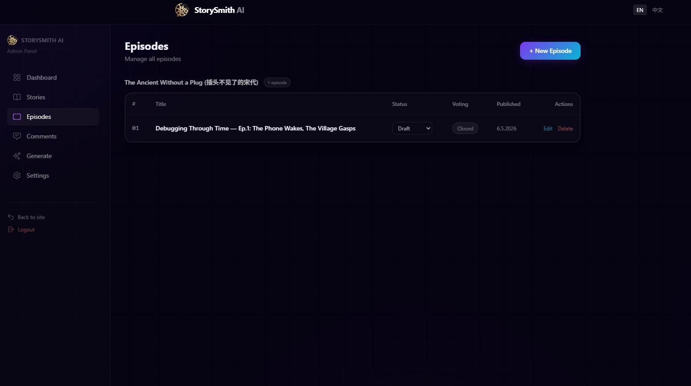

# Admin Panel Guide

**Author: Chong Kiat Lim**

The StorySmith AI Admin Panel is a full-featured web interface for managing stories, episodes, content generation, and audience engagement. Access it at **http://localhost:3000/admin**.

## Dashboard

The dashboard provides an at-a-glance overview of your content production status.


**Metrics displayed:**
- **Stories** — total stories with episode count
- **Total Votes** — audience votes across all episodes
- **Comments** — pending comments awaiting moderation
- **Gen Runs** — completed and failed generation pipeline runs

**Charts:**
- **Episode Status** — donut chart showing published vs. voting-open episodes
- **Comment Moderation** — pending comments preview
- **Episode Engagement** — bar chart of votes and comments per episode
- **Vote Distribution** — breakdown of audience choices per episode

## Story Management

Create and manage story universes. Each story has its own characters, locations, and episode series.


### Creating a Story

1. Click **+ New Story**
2. Fill in the form:
   - **Title (EN)** — English title
   - **Title (ZH)** — Chinese title
   - **Slug** — URL-safe identifier (e.g., `the-ancient-without-a-plug`)
   - **Description** — English synopsis
   - **Background / First Episode Direction** — creative direction prompt for the Writer agent
3. Click **Create**

This automatically creates the folder structure under `data/stories/{slug}/` with template files for the story bible, style guide, characters, and locations.

### Editing a Story

Click **Edit** next to any story to update its title, description, background prompt, or status (active/archived).

## Episode Management

Create, edit, and track episodes within each story.



### Creating an Episode

1. Click **+ New Episode**
2. Select the story
3. Set episode number, title (EN/ZH)
4. Optionally add:
   - **Admin Prompt** — override audience votes with a specific story direction
   - **Voting Options** — 2–4 choices for the audience poll
5. New episodes start as **Draft**

### Episode Detail View

Click an episode title to view its full detail page:


**Displayed information:**
- Title (EN and ZH)
- Metadata: status, voting state, creation date
- Video generation status
- Admin prompt (the creative direction given to the Writer agent)

**Episode statuses:** `draft` → `in_generation` → `ready` → `published`

**Voting states:** `Open` / `Closed`

## Episode Generation

The Generate page is the control center for running the AI pipeline.

### Configuration

At the top of the Generate page, select your configuration:

| Setting | Options | Description |
|---------|---------|-------------|
| **Story** | Dropdown | Which story to generate for |
| **Episode** | Dropdown | Which episode to generate |
| **LLM Model** | Default / specific model | Language model for script/scenes |
| **Video Model** | Seedance 2.0, CogVideoX, Wan2.1, etc. | Video generation model |
| **Video Execution** | Cloud / Local | Cloud API vs. local GPU |
| **Aspect Ratio** | 9:16, 16:9, 1:1, 4:3, 3:4 | Video dimensions |
| **Visual Style** | Chinese Cartoon, Realistic, etc. | Art style preset |
| **Audio Model** | Default / MusicGen / Bark | Audio generation model |

### Pipeline Stages

The pipeline has 8 stages, visualized as a step-by-step progress bar:

```
Script → Scenes → Characters → Video Gen → Quality → Audio → Compose → Publish
```

Each stage shows:
- ✓ Green checkmark when complete
- Spinning icon when in progress
- Step number badge

#### Stage 1: Script (Writer Agent)


Generates the episode script YAML with scenes, dialogue, and vote options. The LLM uses the Writer agent persona to craft a narrative that incorporates audience votes from the previous episode.

**Generated files:** `script.yaml`

#### Stage 2: Scenes (Director Agent)


Breaks the script into detailed clip-by-clip prompts for video generation. Each prompt includes visual description, camera angle, character positions, and continuity notes.

**Generated files:** `scenes_breakdown.yaml`, `scene_*_clip_*_prompt.yaml`

#### Stage 3: Characters (Character Designer Agent)


Generates or updates character reference images and consistency sheets. Shows character avatars with their design files.

**Generated files:** Character YAML sheets, avatar PNG images

#### Stage 4: Video Gen (Artist Agent)


Generates video clips using the configured model (Seedance 2.0 by default). Shows a media preview grid with all generated clips, each with:
- Video preview player (play, volume, fullscreen)
- Filename and file size
- Duration indicator

#### Stage 5: Quality (Quality Inspection)

The quality gate validates all clips against configurable thresholds.


Each clip is reviewed individually with:
- **PASS** (green badge) — clip meets all quality criteria
- **NEEDS REVIEW** (orange badge) — clip has issues requiring attention

For clips that need review, the system provides:


- **Issue description** — what the quality check found (e.g., "Object identity change detected: 2 dramatic content shifts")
- **AI Suggestion** — automated recommendation (e.g., "Ensure the object held by the character remains consistent throughout the clip")
- **Improvement prompt** — editable text field pre-filled with the AI suggestion
- **Accept Suggestion & Regenerate** — apply the AI's fix
- **Regenerate** — regenerate with custom prompt

After regeneration, a side-by-side comparison is shown:


- **ORIGINAL** — the first generated clip
- **REGENERATED** — the improved clip
- **Accept Regenerated** / **Discard** buttons to choose which version to keep

#### Stage 6: Audio (Sound Designer Agent)

Generates background music and optionally narration using MusicGen or Bark.

#### Stage 7: Compose (Editor Agent)


Assembles clips into the final episode video. Shows:
- **Composition options:**
  - Mute Video Audio — strip original audio from clips
  - No Watermark — skip logo watermark overlay
  - Auto Subtitles — transcribe and burn bilingual subtitles
  - Skip Opening — skip title card and AI disclaimer intro
- **Video clips grid** — select/deselect clips to include (with thumbnails and file sizes)
- **Run Step Compose** button

#### Stage 8: Publish (Publisher Agent)


Deploys the episode to the website. Shows:
- **Episode poster variants** — 4 generated posters (horizontal EN/ZH, vertical EN/ZH)
- **Run history** with duration and selection status

### Step Runs

Each stage maintains a history of runs. You can:
- View past runs with timestamps and duration
- Mark a run as **Selected** (its output is used by subsequent stages)
- **Clear All** runs to start fresh
- **Re-run** any stage with updated parameters
- **Delete** individual runs

## Comment Moderation

Review and moderate audience comments before they appear publicly.


**Filter tabs:**
- **Pending** — comments awaiting review (with count badge)
- **Flagged** — auto-flagged comments (profanity, controversial content)
- **All** — complete comment history

**Moderation actions:**
- Approve — make comment publicly visible
- Reject — remove comment
- Flag — mark for further review

**Auto-moderation** is configured in `config/content_policy.yaml`:
- Auto-remove: hate speech, threats, spam
- Flag for review: profanity, controversial topics
- Pass through: constructive feedback, story suggestions

## Settings

Configure admin password and system settings.

**Available settings:**
- **Admin Password** — change login password (auto-syncs to `config/.env`)
- **API Key Status** — shows which API keys are configured
- **Feature Toggles** — enable/disable voting, comments
- **Site Configuration** — site URL, deployment target

## Public-Facing Pages

### Home Page


The landing page shows:
- Hero section: "Stories Shaped By You"
- Story cards with poster images
- "How It Works" section (Watch → Vote → Shape → Repeat)

### Story Page


Each story has a dedicated page with tabs:
- **Episodes** — list of published episodes with poster thumbnails
- **Vote** — active voting poll (if voting is open)
- **Gallery** — episode screenshots and poster art
- **Discussion** — audience comments (moderated)

### Episode Page


The episode detail page shows:
- Video player with the generated episode
- Voting section ("What should happen next?") with countdown timer
- Voting options with descriptions
- Discussion section for audience comments

## Internationalization

The site supports **English** and **Chinese** (中文):
- Language switcher in the top-right corner (EN / 中文)
- All UI text is translated
- Episode titles have both EN and ZH variants
- Posters are generated in both languages
- Locale is stored in a browser cookie
